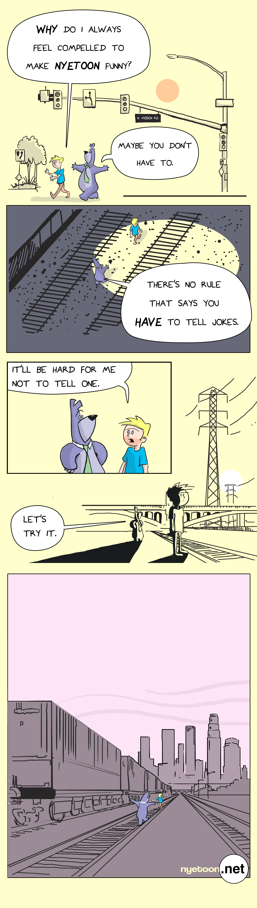

We start the redux with my favorite. Lead with your best, I guess. 

<!-- end -->

## This was one that wrote itself. 

There are moments in work that you just hit the zone. They are moments few and far between, if you let yourself have a moment, you wind up experimenting and making bolder choices. 

You feel more confident drawing power lines and film noire references. 

This one is a lesson for me to not worry about the joke, and maybe just stop worrying so damn much. 

## More in the chanber. 

Im cleaning thru my catalog, choosing the best comics that I feel sort of ok showing. I'm thinking... 30? ish? 

Cleaning them, rebranding them .net, and then encoding them into the site, ...and the git hub. The git hub you ask?
More on that later. 

##### I'm making an effort to interact with people now. 

So. Hi.

I would appreciate the follow along at facebook, or...  I also do twitter, I guess. Ok, I stalk twitter. I hate tweeting. It's just. Ok... 
See you next time for more riveting marketing copy.

You can also just say "Hey Nye, what's up" any way you would like. 
(*Krusty Moan*)

