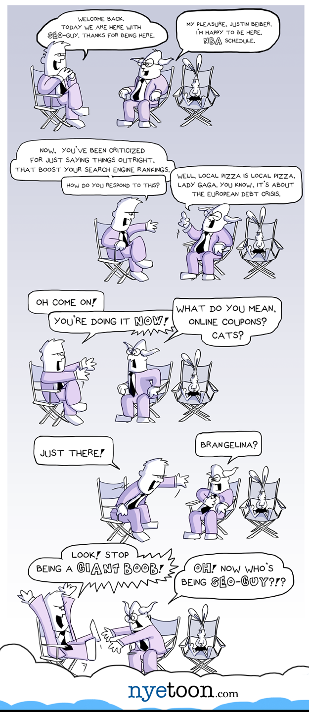
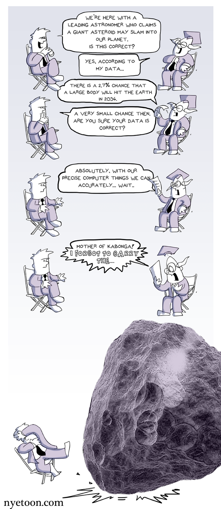
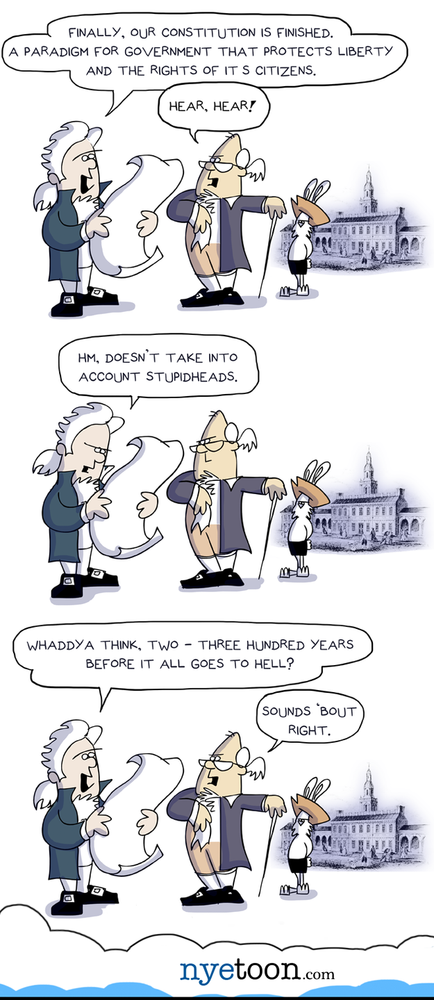
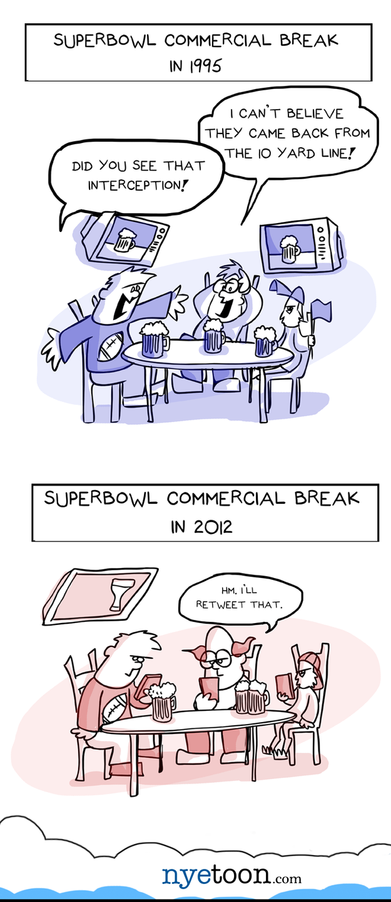

I was inspired to make an internet comic in 2010. I actually had no content. I opened a skethcbook
and drew two guys in ties. I felt compelled to put an animal in and so I drew a rabbit.

I wrote the joke as I read about search engine rankings while I was working with a friend to build the website. On launch, no one would have cared about my website save for my dad and his friend across the hall at Boston University.

This friend linked the comic to his lecture about SEO and a steady trickle of dozens of business students inspired me to draw more comics of the little guys in the ties. These were from around 2011 - 2012.

<!-- end -->

[@nyewarbuton](http://twitter.com/nyewarburton)
