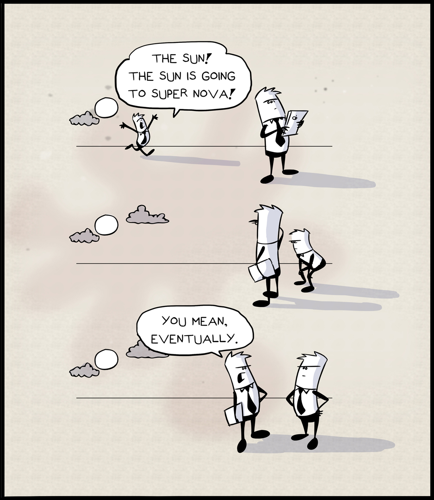
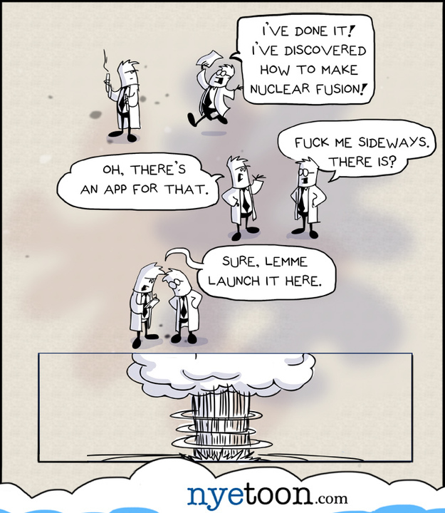
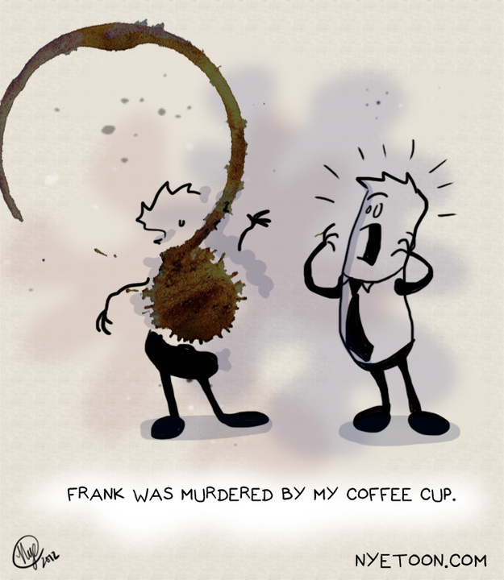
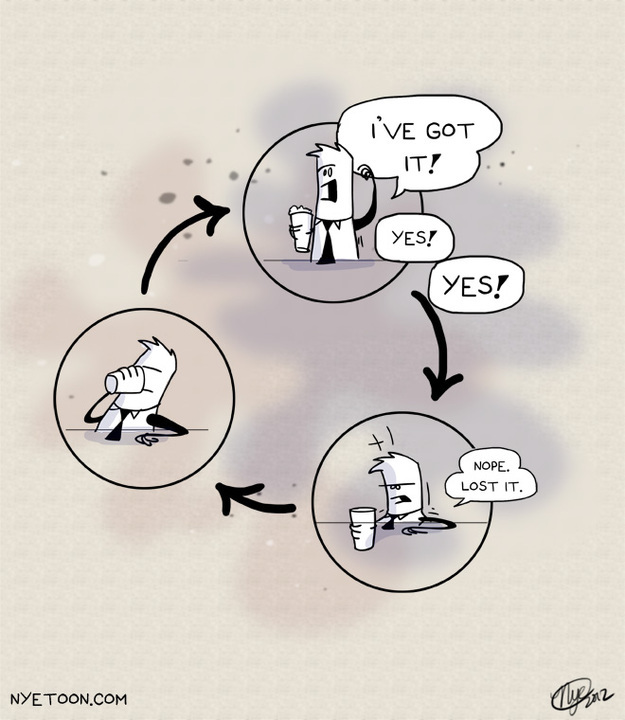
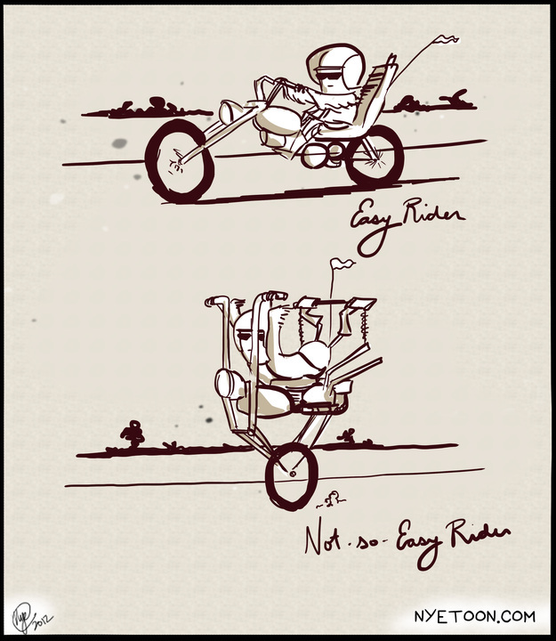
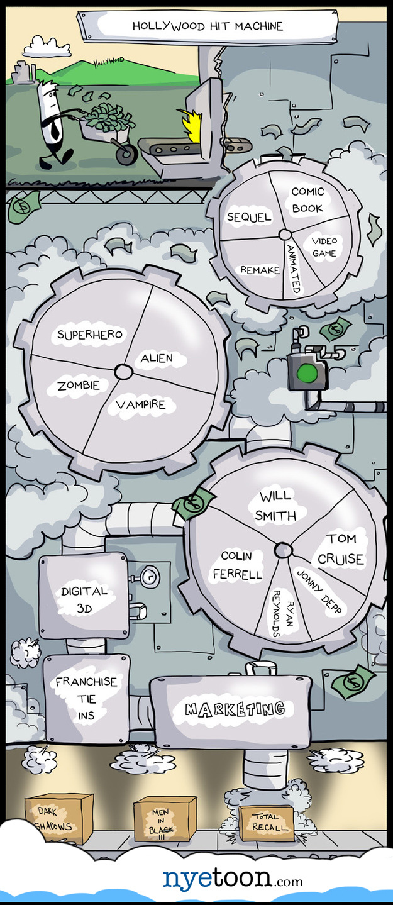
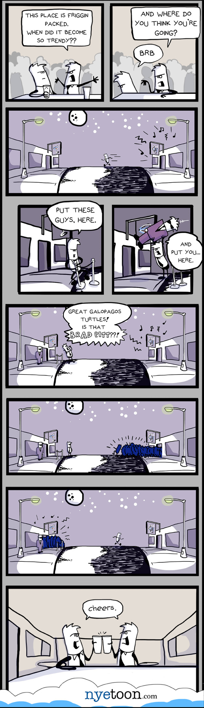
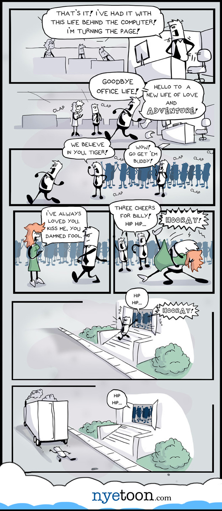

I did these guys a few years ago when I went to New York for a few months to work on a film.

I was alone most nights, so I went to bars myself and drew. You can see how me leaving my drink on my  sketchbook inspired me to create a line of gag comics with these guys. The timing on the sun going supernovae is fucking perfect.

These were inspired by The Far Side, so I wanted a name that worked in the same way. So I came up with "The Sanity Index."

<!-- end -->

When I got back to California, I tried to do some long form content with them.

I sort of ran out of ideas with them. I still doodle them in my sketchbook now and again, but nothing motivating enough to do more with them.

[nyewarburton.com](http://nyewarburton.com)
