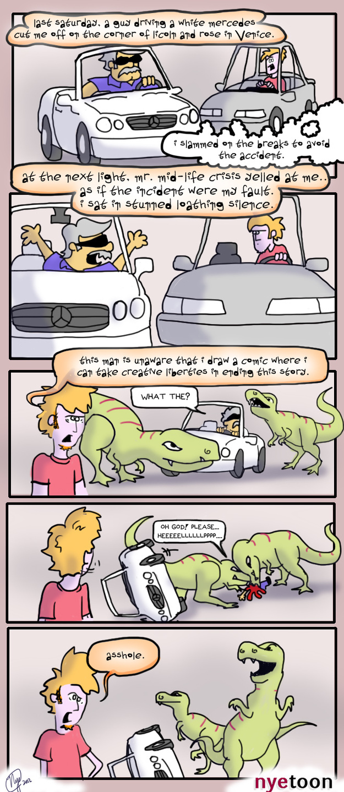
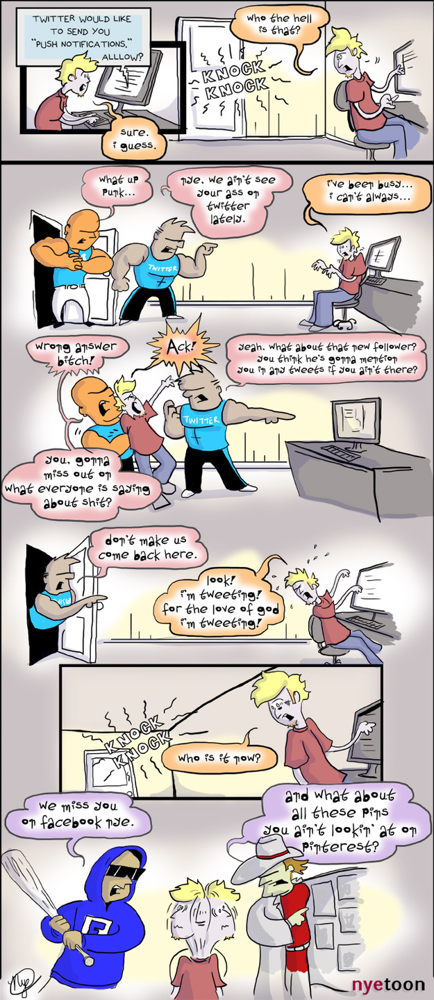
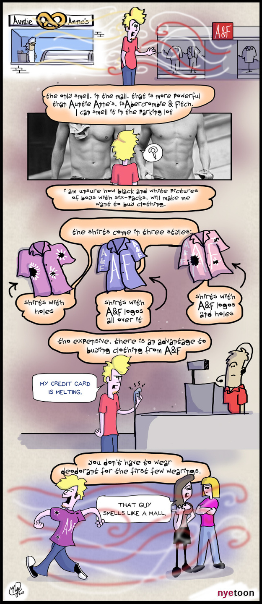
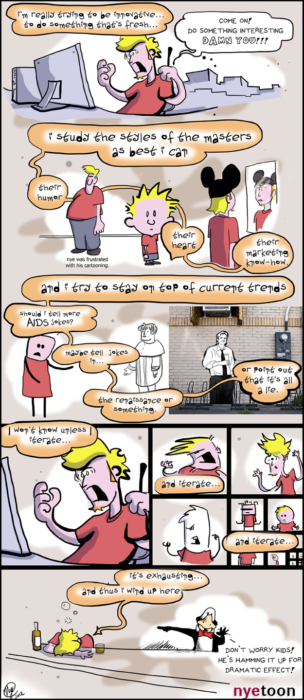
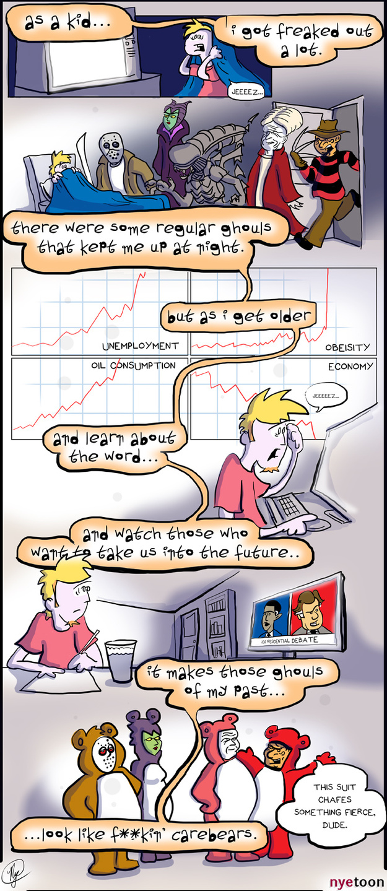
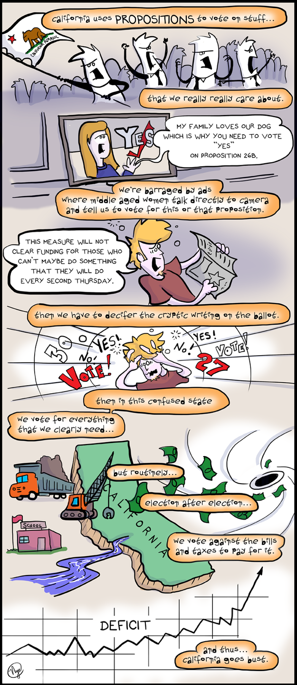
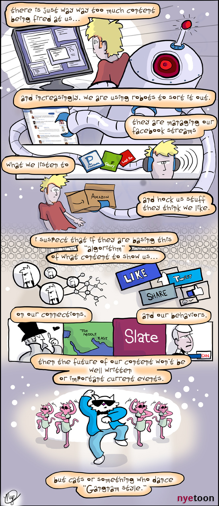
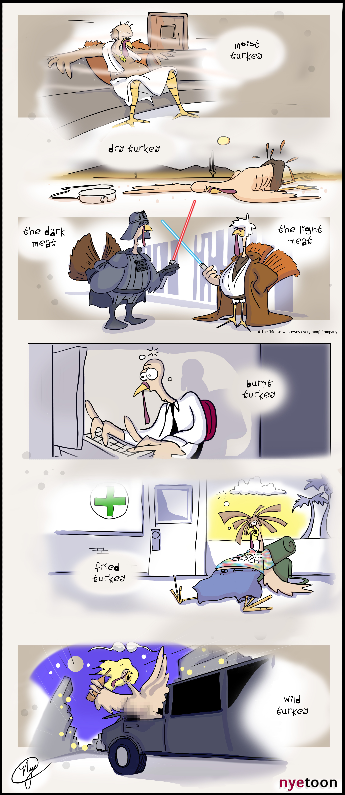

I went on vacation to Istanbul a few years ago. I scribbled some things in my sketchbook that was more of a "travel journal" kind of thing. I started to draw myself as part of the experience.

The way I draw myself has evolved since this version of nyetoon. But this early variation led to more structure in my comic development pipeline. These comics were sort of essays, with my avatar as the thru line.

<!-- end -->

[nyewarburton.com](http://nyewarburton.com)
