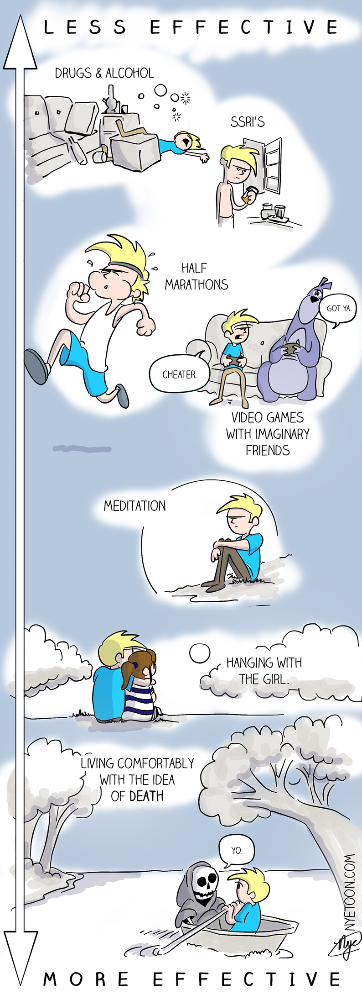
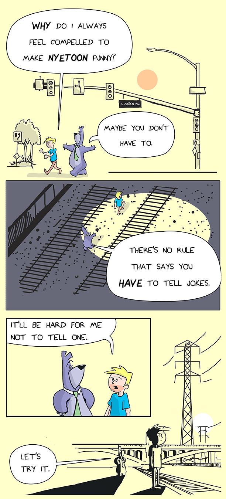
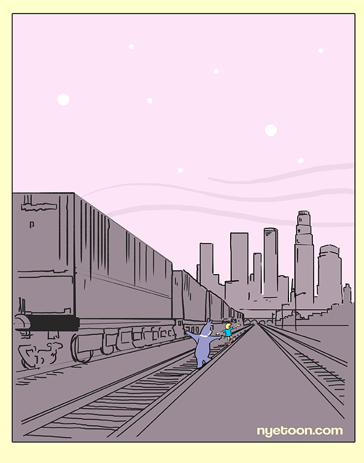
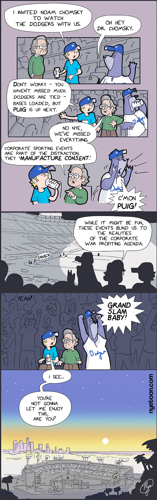
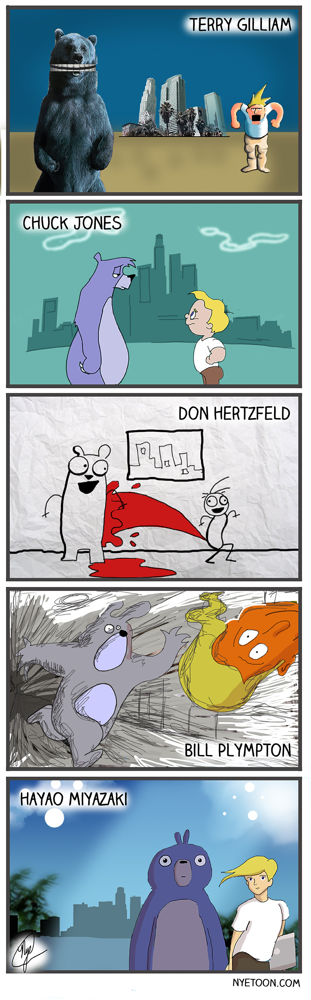
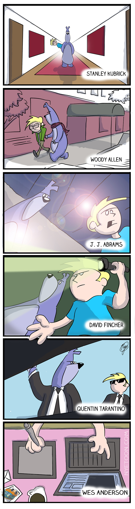
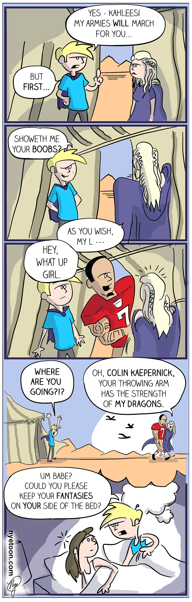
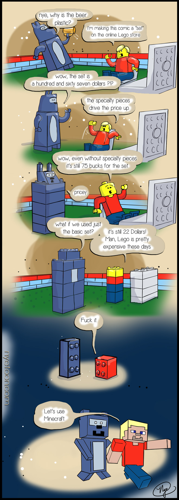
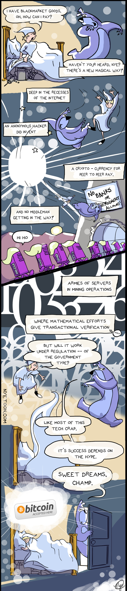
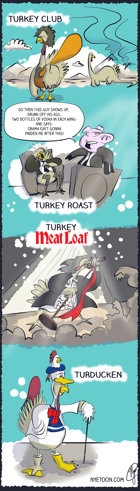

During this point, I was posting nyetoon once or twice a month.

I was regularly getting hundreds, and sometimes thousands, of hits. I had fans.

The truth is, I hated everyone reading it. It felt weird to write personal things. I felt exposed.
The night before posting a comic, my insides would flip over. I could never push the publish button myself, I had to automate it to go at 3 in the morning.

There are some moments in here when I was really in sync with my writing ...and I chickened out. I stopped doing it regularly and I never hit my stride like this again.

The lesson. If you don't keep at it, you lose it.

<!-- end -->

I had eight different emails from people hating on Chomsky from this one.

This one blew up on the GOT reddit a bit, until the moderator told me it couldn't be in the game of thrones reddit.

This was the beginning of a long time interest in blockchains.

[nyewarburton.com](http://nyewarburton.com)
