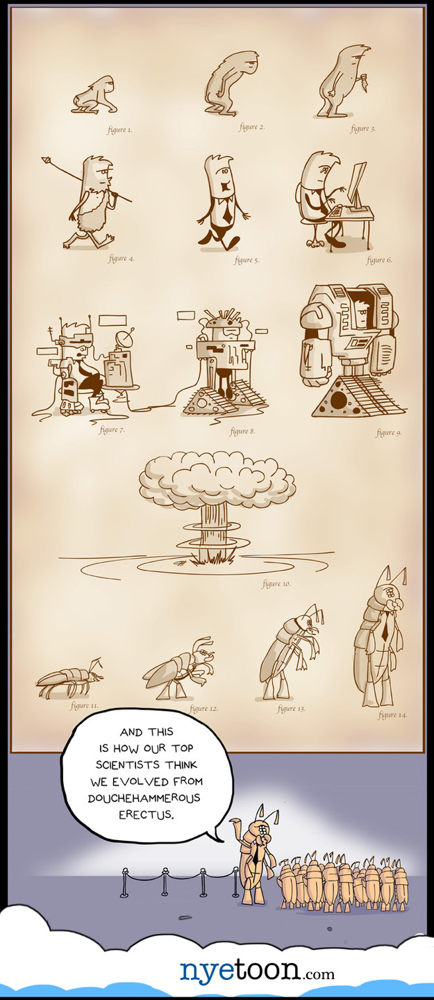
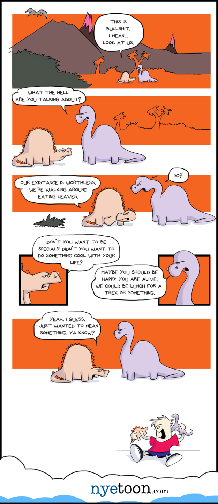
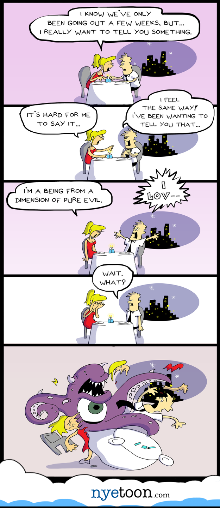

Stuff from when I first started... "for realzies."

<!-- end -->

## I'm gonna make webcomics!

I had this thought after realizing that anyone could simply upload any idea they want to the internet. 
Little did I know that getting good at it requires patience, focus, and massive amounts of self confidence 
...to do anything worthwhile. 

These are my first go rounds from almost 8 years ago. 
Not bad, lots of potential. Just no real focus or direction.

Do your thing. More to come. 
[@nyetoon](http://twitter.com/nyetoon)

