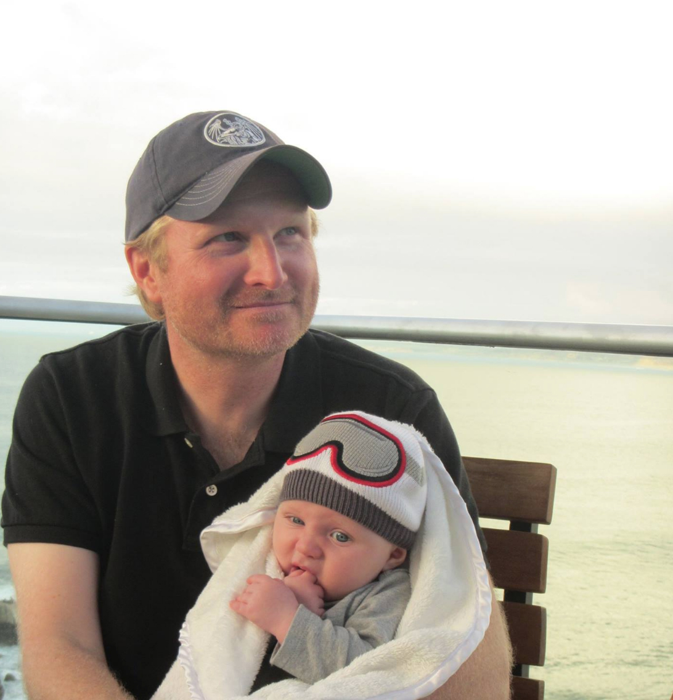

<!-- end -->

Nyetoon was written, illustrated and developed by Nye Warburton.

This is a static web application built with gatsby JS, and hosted using Netlify. It is a mod of Ryan Fitzgerald's DevBlog template.

Comics are written and drawn on paper, with photoshop for clean up and coloring.

## License

Licensed under MIT License. See [LICENSE.md](LICENSE.md) for more.

For more information about the author visit
[nyewarburton.com](http://nyewarburton.com)
