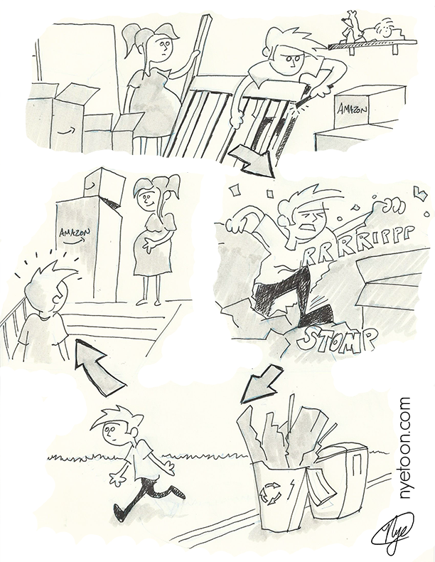

Nyetoon.com is dead. (... fuck wordpress) 

But I've managed to save some of the comics! And seeing as some of the original files were stolen from the family storage locker. (...good times) I've decided to rebuild the content that is left into a new site. 

And perhaps I'll be inspired to scribble a few new ones. 

<!-- end -->

## Welcome to Nyetoon.net as a static web application. 

I've decided to take control of the content in a static web application, and will update all of the relevant information in the devlog on github. 

### This is an experiment in open source cartooning

Yes, I am saddened by the loss of my comics and wish to preserve them, but I also have been really interested in some new ideas in the creative community. 

I intend to open source the tools that may come out of this. And I have some thoughts about what to do with the comics themselves.  

#### More to come. See you soon?

Thanks for reading. (Ps, I added the best comic description of what I've been up to.)



```javascript
$(document).ready(function() {
    console.log('More jQuery, No clue what I'm doing!)
})
```

